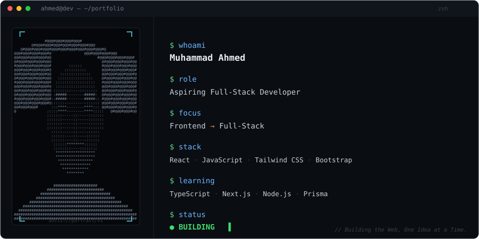
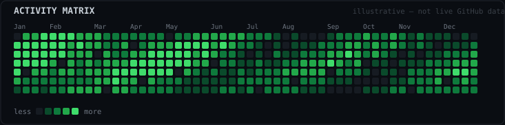

<div align="center">



</div>

<br>

## `>` working technologies

```
frontend/
├── HTML
├── CSS
├── JavaScript
├── React
├── Tailwind CSS
└── Bootstrap

expanding/
├── TypeScript
├── Next.js
├── Node.js
└── Prisma

tools/
├── Git
├── GitHub
├── REST APIs
└── VS Code
```

<br>

## `>` currently building

```
Frontend Development
        │
        ▼
React Applications
        │
        ▼
TypeScript
        │
        ▼
Next.js
        │
        ▼
Full-Stack Development
```

Alongside the core path above, I'm also exploring **AI automation with n8n** — wiring up workflow automations as a complement to frontend/full-stack work, not a replacement for it.

I'm a BS Computer Science student at NUML, based in Rawalpindi, Pakistan — learning primarily by building real projects rather than by credential alone.

<br>

## `>` selected projects

```
$ ls ./projects
```

**01 · BYTESOLTECH**
Project details pending — description, stack, and links to be added.
`[ SOURCE: pending ]` `[ LIVE: pending ]`

**02 · THINKERQUIZ**
Project details pending — description, stack, and links to be added.
`[ SOURCE: pending ]` `[ LIVE: pending ]`

**03 · REACT PROJECT**
Project details pending — description, stack, and links to be added.
`[ SOURCE: pending ]` `[ LIVE: pending ]`

**04 · TRAVERSE — Landing Page**
Project details pending — description, stack, and links to be added.
`[ SOURCE: pending ]` `[ LIVE: pending ]`

> These four are placeholders on purpose — see **"What I still need from you"** below for exactly what to send over so each entry can carry a real description, stack, and links instead of invented ones.

<br>

## `>` activity matrix

<div align="center">



</div>

<br>

## `>` connect

[GitHub](https://github.com/ahmed-codes-tech) · [LinkedIn](https://linkedin.com/in/muhammad-ahmed-5b173231/) · [Instagram](https://instagram.com/ahmed_codes_tech)

<br>

<div align="center">
<sub><i>Building the Web, One Idea at a Time.</i></sub>
</div>
